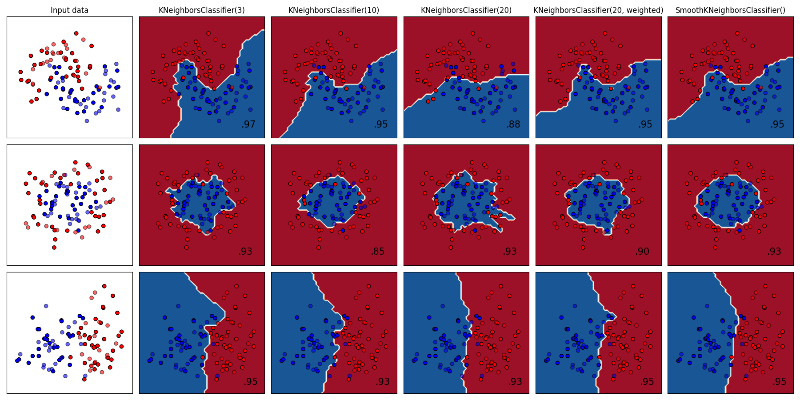

# Smooth k-nearest neighbors classifier

## Comparison


## Results
| | Make Moons | Make Circles | Linearly Separable | Iris | Wine | Average | 
| - | - | - | - | - | - | - | 
| Smooth Nearest Neighbors | 0.95 | 0.925 | 0.95 | 0.9833 | 0.9722 | 0.9561 | 
| Nearest Neighbors | 0.975 | 0.925 | 0.95 | 0.9833 | 0.9444 | 0.9556 | 
| Gaussian Process | 0.975 | 0.9 | 0.925 | 0.9833 | 0.9583 | 0.9483 | 
| Neural Net | 0.9 | 0.875 | 0.95 | 0.9833 | 0.9861 | 0.9389 | 
| AdaBoost | 0.925 | 0.85 | 0.95 | 0.9833 | 0.9722 | 0.9361 | 
| Decision Tree | 0.95 | 0.775 | 0.95 | 0.9833 | 0.9444 | 0.9206 | 
| Random Forest | 0.95 | 0.75 | 0.95 | 0.9833 | 0.9583 | 0.9183 | 
| Naive Bayes | 0.875 | 0.7 | 0.95 | 0.9667 | 1.0 | 0.8983 | 
| QDA | 0.85 | 0.725 | 0.925 | 0.9833 | 0.9722 | 0.8911 | 
| RBF SVM | 0.975 | 0.875 | 0.95 | 0.9833 | 0.375 | 0.8317 | 
| Linear SVM | 0.875 | 0.4 | 0.925 | 0.9 | 0.9861 | 0.8172 | 

## Installation
```
pip install smooth-knn
```

## Usage
```python
from smooth_knn.classifier import SmoothKNeighborsClassifier

clf = SmoothKNeighborsClassifier()
clf.fit(X, y)
```
